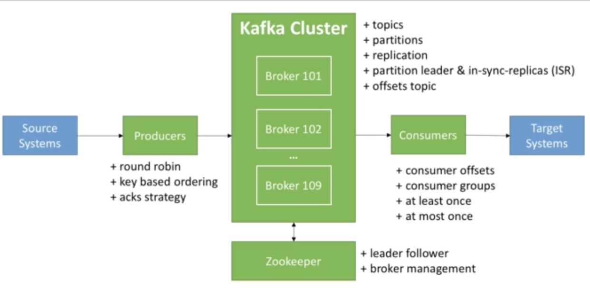

# Kafka

A high-throughput distributed messaging system - Decoupling of data systream and systems

## Kafka theory

### Topics

A particular stream of data. Like a table in a database, it has a name. You can have as many topics as you want.

Topics are split in *partitions*: 

- Each partition is ordered
- each msg within a partition gets an increamented id, called *offset*.

kafka topic 
- partion0: 0, 1, 2, 3, 4
- partion1: 0, 1, 2
- partition2: 0, 1, 2, 3

You choose the number of partition you want at the time of creation of a topic.
- order is guaranteed only within a partition
- data is kept for limited amount of time - default 7 days
- once data is written it can't be changed - immutability 

#### Example
A trucking company that collects locations(long and lat) from GPS on each truck. GPS sneds data every 15 seconds to kafka topic called `gps_truck`.


### Brokers

A Kafka cluster is composed with multiple brokers(servers).
- each broker contains certain topic partitions
- after you are connecting to any broker (called bootstrap broker), you will be conncted to the entire cluster.

Kafka is a distributed system. The topics are replicated and thier partions are distributed across brokers.

When you create a topic, you want it to be replicated (called replication factor), 3 is usually the gold standard. 

So in the event say we loose a broker, other brokers which hold the copy of the data can still deliever messages.

#### Leader of partition

At any time only one broker can be the leader of a partition. Only that leader cam receieve and serve data for a partition. Others are called ISR(in-sync-replica). 

This election process is done by Zoo Keeper in the background.

### Producers

Producers write data to topics
- they automatically know which broker and partition to write to (magic!)
- if a broker fails, producer will automatically recover

#### Message keys
- if producers choose to send a key with a message, all messages for that key will always go to the same partition. For example, if you want messasges for your truck ordering for a specific field, you can use truck_id as your key.

- you will choose number of acknoledgment. 0 means quick and risky. 1 is one ack, and all is the safest.

### Consumers

Consumers read data from a top
- know which broker to read from automatically
- in case of broker failures, consumers know how to recover.

#### Consumer Groups

Consumers read data in consumer groups. A group is basically an application. E.g., A consumer group for databoard where you have two consumers, another consumer group for analytics app, where you have three consumers)
- each consumer within a group reads from exclusive partitions (i.e, you don't have consumers within the same group read from the same partition)
- therefore, you should have more partitions than your consumer in the same group. Usually you have as many consumers as your partitions.


#### Consumer offsets

When a consumer group reads from a topic, it commits its offset to a topic named `__consumer_offsets`. This is so, when a consumer dies, it knows where it leftoff and will be able to read back.

### Zookeeper

Zookeeper manages brokers (keep a list of them)
- helps in performing leader election for partitions
- sends notification to Kafka in case of changes (e.g., broker dies, new top, broker comes up, topic delete)

Zookkeep is needed for Kafka. We will need to start the zookeeper.

Kafka cluster is connected to the zookeeper cluster, automatically, the zookeeper will understand when brokers are down, topic is created etc.

#### Kafka guarantees

- Messages are appended to a topic-partition in the order they are sent
- Consumers read the messages in the order stored in a topic-partition
- When a replication factor of N, producers and consumers can tolerate up to N-1 brokers being down. I.e., if you have N=1 (no replication) then when the broker is down you are doomed :(

#### Roundown
 



## Installation

Download kafka from https://kafka.apache.org/downloads.
Choose Binary downloads.

Once downloaded, just move it to your root and unzip it
```bash
mv Downloads/kafka_2.12-3.0.0 ~/
tar -xvf kafka_2.12-3.0.0.0
```

Then you can go into the folder the execute the shell script to make sure Java is working.
```bash

cd kafka_2.12-3.0.0
bin/kafka-topics.sh
```

Add the path to the binary, so you can run kafka command from anywhere
```bash
vim ~/.bash_profile  # or zsh
# add this to the bottom
PATH="$PATH:/Users/usr/kafka_2.12-3.0.0/bin"
```

You can also use brew to install kafka. This way when you run kafka command you don't need to include the .sh "kafka-topics.sh" vs "kafka-topics"
```
brew install kafka
```

But we still need to binary to be able modify the config file.


### Start Zookeeper and Kafka server

To start zookeeper servrer, Go to the kafka folder, run:
```bash
zookeeper-server-start.sh config/zookeeper.properties

```

By default, zookeeper will be running on port 2181.


Now, to better manage the app, we can change the data folder from the dedault `/tmp/` to a new directory, for example, here I updated the config file `config/config/zookeeper.properties` to point the dataDir to below folder which we mannually created.

```
# the directory where the snapshot is stored.
dataDir=/Users/hsin/kafka_2.12-3.0.0/data/zookeeper
```
This way, when you start the zookeeper server, you will see a folder called `version-2` created under that dataDir.

Similarly, we will update the config file `/config/server.properties` and update this line as such:
```
# A comma separated list of directories under which to store log files
 log.dirs=/Users/hsin/kafka_2.12-3.0.0/data/kafka
```

Finally, we will start kafka server by running:
```bash
kafka-server-start.sh config/server.properties
```

GNow you should have two instances running, one for kafka, one for zookeeper.


### CLI tools

#### Topic
- To create a topic, you need to specify the zookeeper port, number of partitions, number of replication-factor. Notice, you can't have the number of replication factor greater than the number of brokers you have.

-- Notice, the option --zookeeper has been deprecated so we should instead use --bootstrap-servrer, and we will use port 9092 instead of 2181
```
kafka-topics.sh --bootstrap-server 127.0.0.1:9092 --topic first_topic --create --partitions 3 --replication-factor 1
``` 

To see the topics created:
```bash
kafka-topics.sh --bootstrap-server 127.0.0.1:9092 --list
```

Run --describe to see more info about a topic
```
kafka-topics.sh --bootstrap-server 127.0.0.1:9092 --topic first_topic --describe
# will give you something like this
Topic: first_topic	TopicId: VlY3zMSMQEmdVo4MU3-_gA	PartitionCount: 3	ReplicationFactor: 1Configs: segment.bytes=1073741824
	Topic: first_topic	Partition: 0	Leader: 0	Replicas: 0	Isr: 0
	Topic: first_topic	Partition: 1	Leader: 0	Replicas: 0	Isr: 0
	Topic: first_topic	Partition: 2	Leader: 0	Replicas: 0	Isr: 0

# shows info for every topic-partition
# Leaader 0 means the leader is borker 0 (recall brokers are identified by number
# Replicas 0 means it's in broker 0
# ISR(in siync replicas) is in broker 0
```

To delete a topic,
```
kafka-topics.sh --bootstrap-server 127.0.0.1:9092 --topic second_topic --delete
```


#### Console producer
- Console producer command
You can send massage from the consloe using kafka-console-producer
```bash
kafka-console-producer.sh --broker-list 127.0.0.1:9092 --topic first_topic
```

You can change the producer properties as well:
```
kafka-console-producer.sh --broker-list 127.0.0.1:9092 --topic first_topic --kafka-console-producer.sh --broker-list 127.0.0.1:9092 --topic first_topic --producer-property acks=all
```

By the way if you send a message to a topic that does not exist, it will create a new topic for you with the dedault property settings. To change the default settings like the number of partitions, go to `/config/server.property`

#### Consle consummer

- Use kafka-console-consummer.sh

```bash
kafka-console-consumer.sh --bootstrap-server 127.0.0.1:9092 --topic first_topic

```

Now if you send a messsage from producer you will see the message received by the consummer. You cam have two windows side by side to better observe this.

- If you want to see all the messages written to the topic you can run:

```bash
kafka-console-consumer.sh --bootstrap-server 127.0.0.1:9092 --topic first_topic --ffrom-beginning
```
#### Consummer group in action

You can create a consummer group and as long as you use the same consummer group, when you create another consummer instance the message will be distributed to different consumer. E.g, one gets "msg1", another one gets "msg2" and so on.

```

kafka-console-consumer.sh --bootstrap-server 127.0.0.1:9092 --topic first_topic --group my-first-app
```
Only one consumer will receive a message each time.

- To see the consumer groups you can run

```bash
kafka-consummer-groups --boostrap-server localhost:9092 --list

```

To see the consumer groups's status on offset,
```
kafka-consummer-groups --booststrap-server localhost:9092 --describe --group my-first-app
```

The current offset tells you where you are in terms of the msg consumption, the log-end-offset tells you the last offset. To catch up you start the cusummer and it will start from where you left over.

##### Play the messages with specified offset

For example, you to do `--to-earlies`
```
kafka-consummer-groups.sh --booststrap-server localhost:9092 --group my-first-app -reset-offsets --to-earliest --execute --topic first_topic

```
Shift offset by 2 (if your current was 0 this will change it to 2)
```bash
kafka-consumer-groups.sh --bootstrap-server localhost:9092 --group my-first-app --reset-offsets --shift-by 2 execute --topic first_topic

```


